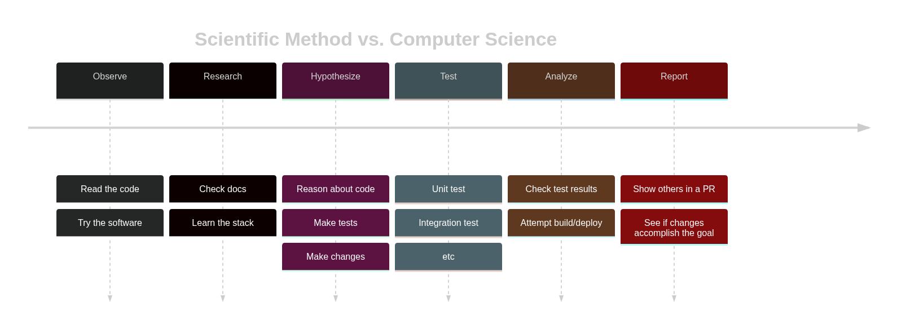

### What's in a name?

Hello! Welcome one and all! Thank you so much for stopping by for my inaugural blog post. I'm OldWorldBoa and *this* is The Byte Station. Stick around as I explore what it means to be a computer scientist, from philosophy to nitty-gritty implementation.

First, a little bit about me; I love getting in the zone, solving puzzles, and learning new things. This has made computer science a very fulfilling path for me: there are so many cool things to do if you're self motivated. I've got my Bachelor's in Computers Science with Honours and I've been working for about a decade now. It's high time I stretch my creativity with something new; hopefully helping/entertaining some folks along the way.

I'm 30ish, Canadian, a dad, a middle child, and an introvert. Most relevant here, I'm a ___computer scientist___.

In our industry, we're called a lot of things: programmers, developers, coders, software engineers, and more. And to me, most of those names reduce what I do to being a keyboard monkey at worst, and at best, a discount engineer. I am a _computer scientist_: I ply all of my analytical skill to solving problems and proving solutions, specifically with computers.

Think about it: science is characterized by the [scientific method](https://commons.wikimedia.org/wiki/File:The_Scientific_Method.svg); or observe, research, hypothesize, test, analyze, and report conclusions. While this might seem far away from the daily grind of wading through legacy code bases, I assure you, it's truly not that far away. Check this out:

There are some obvious differences- hypothesize and making changes aren't quite analogous. But riddle me this: how close to science do I have to get before I can call myself a scientist (with qualification).

I like to think of this as a point of professional pride; I'm not just typing on a computer. I'm not just designing programs. I'm not a discount engineer. My great passion for exploration and penchant for rigour steeps my practice as a computer __scientist__. My love of technology and thrill in learning drives me as a __computer__ scientist.

If you're not a computer scientist, then what are you? Let me know how you see yourself and what your job title means to you!
